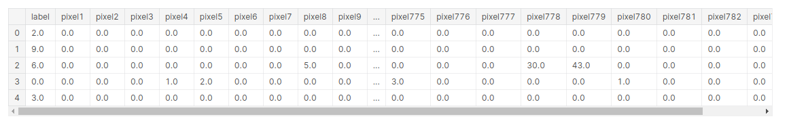
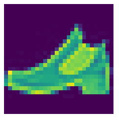

# Pytorch-ile-Artificial-Neural-Networks

# Pytorch Nedir?

Zaman içerisinde makine ögrenmesi algoritmaların problemlere çözüm olmasının azalmasıyla birlikte, verilerin boyutunun her geçen gün artmasıyla 
Deep Learning algoritmaların kullanılması da artmaktadır. Bu kapsam da ses tanıma, görüntü işleme, görüntü sınıflandırma, nesne tanıma vb. çalışmalarda 
derin ögrenme algoritmaları daha başarılı sonuçlar üretmiştir. Tüm bu işler yapılırken aynı zaman da zaman dan kazanmak için hız gereksinimi dogmuştur.
Bu bağlamda bakıldığında Pytorch derin ögrenme algoritmarın hızlı çalışmasını sağlayan açık kaynak bir python kütüphanesidir.

Pytorch ekran kartlarını kullanabilen ve böylelikle sağladığı hız bakımından oldukça popüler bir kütüphanedir.Pytorch'un başarılı olmasının nedenlerinden
bir tanesi de sinir ağı modelleri zahmetsizce oluştura bilmesidir. Pytorch aynı anda CPU ve GPU gibi arka planda başka işler için yapıları kullanabilir.
Pytorch'un Numpy kütüphanesine benzer kendi bir Tensor yapısı mevcuttur.

# Artificial Neural Networks Nedir ve Nasıl Çalışır?

Artificial Neural Networks(Yapay Sinir Ağları) derin ögrenme veya derin sinir ağı olarak adlandırılır. Temelinde Derin Ögrenme Bölüm-1 de bahsedilen Logistic Regression ![https://yz-ai.github.io/blog/derin-ogrenme/Pytroch-ile-Logistic-Regression] modelini alıp bu işlemi iki kez veya daha fazla tekrar etmektedir. ANN algoritmasında Logistic Regression algoritmasında olduğu gibi girdi ve çıktı katmanları vardır. Bu katmanlar arasında ekstra da hidden layer(gizli katman) adı verilen bir katman vardır. Arada bulunan bu gizli katmanların sayısı da aslında Derin Ögrenmedeki derin kelimesinin baş mimarını oluşturmaktadır.

Hidden layer girdilari görmedigi için gizli olarak nitelendirilir.Ayrıca girdi katmanı toplam katman sayısına dahil edilmez. ANN algoritmasını resim üzerinde inceleyelim.

 
 
 Resimde de görüldüğü üzere girdi ve çıktı katmanların arsında bir tane de hidden layer bulunmaktaır. Bu gizli katmanın 5 adet düğümü olduğu görülmektedir. Burada belirtilen düğüm sayısı aynı zamanda modelin daha iyi sonuçlar verebilmesi için kullanılan hyper parametrelerinden bir tanesidir.
 ANN algoritmasında Logistic Regressionda olduğu gibi girdi katmanları ve çıktı katmanları değişmez.
 
 Girdi katmanından hidden layer giderken tercih edilen activasyon fonksiyonları kullanılır.(tanh,sigmoid.RELu vb.) Activasyon fonsiyonların ayrıntılı bir şekilde ögrenmek istiyorsanız @Merve Ayyüce Kızrak hocamın yazısını okumanızı tavsiye ederim. ![https://ayyucekizrak.medium.com/derin-%C3%B6%C4%9Frenme-i%C3%A7in-aktivasyon-fonksiyonlar%C4%B1n%C4%B1n-kar%C5%9F%C4%B1la%C5%9Ft%C4%B1r%C4%B1lmas%C4%B1-cee17fd1d9cd]
 Genellikle hidden layer katmanına giderken tanh activasyon fonksiyonu tercih edilir modelin daha iyi ögrenmesine sebebiyet verecektir.
 Hidden layerdan sonra gelen kısım aslında Logistic Regressiondaki yapının aynısıdır.
 
 Resimde Görülecegi üzerine bir ileri yayılım(Forward) birde geri yayılım gözükmektedir(backward). İleri yayılım Logistic Regressiondaki yapının aynısı sadece bunu iki kez ve daha fazla yapılmasıdır. Geriye doğru yayılım ise işlemin türevini almak demektir. Geriye yayılımdan elde edilen parametreler ile model tekrar eğitilir bu işleme de update parameters denilir.
 
 Kısaca ANN algoritmasının çalışmasından bahsettikten sonra Pytorch ile Örnek bir veri seti üzerinde modelimizi oluşturalım.
 
 # Dataset

Kullanılan veri seti kaggle'dan elde edilmiştir. Link bilgisi aşağıdaki gibidir.

![https://www.kaggle.com/datasets/zalando-research/fashionmnist]

Veri setinden kısaca bahsedilecek olursa içerisinde 28*28 pikselden oluşan içerisinde 60000 train(eğitim) ve 10000 test verilerinden oluşan
içerisinde 10 sınıf barındırıan bir veri setidir. Burada piksel değerleri 0 ile 255 arasındadır. Her bir resim 784 pikselden oluşmaktadır.

Adım adım önce veri ön işleme basamaklarından gerçirilir ve model oluşturularak tahmin değerleri elde edilir.

     import torch
     import torch.nn as nn
     from torch.autograd import Variable
     from torch.utils.data import DataLoader
     import pandas as pd
     import numpy as np
     import matplotlib.pyplot as plt
     from sklearn.model_selection import train_test_split
     
Kütüphaneler yüklendikten sonra veri seti pandas yardımı ile okunur.
   
     train=pd.read_csv('data/digit-recognizer/train.csv',dtype=np.float32)
     train.head()
     
 
 
 
     test=pd.read_csv('data/digit-recognizer/test.csv',dtype=np.float32)
     test.head()
  
   
 
 Bu kısımda Normalizasyon için 255(toplam piksel degerleri sayısı) bölünerek gerçekleştirilmiştir.
 
    target_numpy=train.label.values
    features_numpy=train.iloc[:,train.columns!="label"].values/255
    
 Veri setini sklearn kütüphanesi kullanarak %80 train,%20 test olarak bölünmüştür.
    
    features_train,features_test,target_train,target_test=train_test_split(features_numpy,
                                                                      target_numpy,
                                                                      test_size=0.2,
                                                                      random_state=42)
                                                                      
Bölümlere ayrılan veri setleri pytorch kütüphenesinin kullanabilmesi için Tensor dönüştürülmesi gerekmektedir. Bunun için "from_numpy" kullanılmaktadır. "type(torch.LongTensor) büyük veri setlerin de kullanılmaktadır."                                                   
                                                   
                                                                      
    featuresTrain=torch.from_numpy(features_train)
    targetTrain=torch.from_numpy(target_train).type(torch.LongTensor)

    featuresTest=torch.from_numpy(features_test)
    targetTest=torch.from_numpy(target_test).type(torch.LongTensor)
    
    
Batch_size: Veri kümesini kaç gruba bölmesi gerektigi belirtilir. number_of_iteration= Kaç iterasyon çalıştırılmsı gerektiği num_epochs= 1 epoch da toplam iterasyonun,toplam futures/batch_size bölünmesidir.    

    batch_size=300
    number_of_iterarion=30000
    num_epochs=number_of_iterarion/(len(features_train)/batch_size)
    num_epochs=int(num_epochs)
    
    train=torch.utils.data.TensorDataset(featuresTrain,targetTrain)
    test=torch.utils.data.TensorDataset(featuresTest,targetTest)
    

Veri ön işleme kısmında son adım olarak tensor dönüştürülen verilerin pytorch tarafından kullanılabilmesi için DataLoader olarak depolanması gerekmektedir. "shuffle" datayı karıştırıp karıştırılmamsı için kullanılmaktadır.

    train_loader=DataLoader(train,batch_size,shuffle=False)
    test_loader=DataLoader(test,batch_size,shuffle=False)
    
    import matplotlib.pyplot as plt
    plt.imshow(features_numpy[1].reshape(28,28))
    plt.axis("off")
    plt.savefig("graph.png")
    plt.show()
    
    
 
Model oluşturulur.

    class AnnModel(nn.Module):
    def __init__(self,input_dim,hidden_dim,output_dim):
        super(AnnModel,self).__init__()
        
        #input_layer
        self.fc1=nn.Linear(input_dim,hidden_dim)
        self.relu1=nn.ReLU()
        
        #hidden_layer1
        self.fc2=nn.Linear(hidden_dim,hidden_dim)
        self.tanh2=nn.Tanh()
        
        #hiddden_layer2
        self.fc3=nn.Linear(hidden_dim,hidden_dim)
        self.elu3=nn.ELU()
        
        #output_layer
        self.fc4=nn.Linear(hidden_dim,output_dim)
        
    def forward(self,x):
        
        #func1
        out=self.fc1(x)
        out=self.relu1(out)
        
        #func2
        out=self.fc2(out)
        out=self.tanh2(out)
        
        #func3
        out=self.fc3(out)
        out=self.elu3(out)
        
        
        out=self.fc4(out)
        return out

        input_dim=28*28
        hidden_dim=150
        output_dim=10

        #model
        model=AnnModel(input_dim,hidden_dim,output_dim)

        #loss
        error=nn.CrossEntropyLoss()

        #optimizer
        learning_rate=0.02
        optimizer=torch.optim.SGD(model.parameters(),lr=learning_rate)
        
 Test ve Tahmin adımına geçilir.
 
        count=0
        loss_list=[]
        iteration_list=[]
        accuracy_list=[]

        for epoch in range(num_epochs):
            for i,(images,labels) in enumerate(train_loader):
        
               #Variable(input)
               train=Variable(images.view(-1,28*28))
               label=Variable(labels)
        
               #zero.grad()
               optimizer.zero_grad()
        
               #model(train)
               outputs=model(train)
        
               #loss
               loss=error(outputs,label)
        
               #backward
               loss.backward()
        
               #update parameters
               optimizer.step()
        
               count +=1
        
               if count % 50 == 0:
            
                  correct=0
                  total=0
            
                 #tahmin dataset
                 for images,labels in test_loader:
                
                    #test variable
                    test=Variable(images.view(-1,28*28))
                
                    #test model
                    outputs=model(test)
                
                    #max tahmin degeri
                    predicted=torch.max(outputs.data,1)[1]
                
                    #toplam label
                    total +=len(labels)
                
                    #toplam dogru tahmin
                    correct +=(predicted ==labels).sum()
                
                 accuracy=100*correct/float(total)
            
                 #her bir iterationdaki hata
                 loss_list.append(loss.data)
                 iteration_list.append(count)
                 accuracy_list.append(accuracy)
        
                if count % 500 == 0:
                   print('Iteration: {} Loss: {} Accuracy: {} %'.format(count,loss.data,accuracy))
 
    

